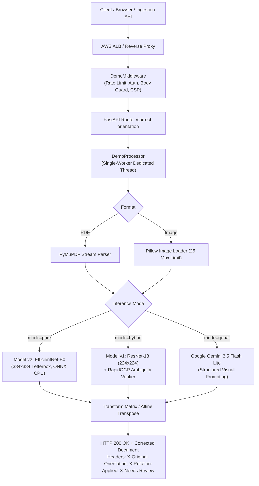

# Enterprise Document Orientation Correction Service

[](https://www.python.org/downloads/)
[](https://fastapi.tiangolo.com)
[](https://onnxruntime.ai/)
[](https://ai.google.dev/)
[](docs/AWS_DEPLOYMENT_RUNBOOK.md)
[](tests/)

A hardened, high-throughput microservice for automatic document orientation detection and correction (0°, 90°, 180°, 270°). Built for enterprise document ingestion pipelines, scanned paperwork, mobile camera uploads, and multi-page contract processing.

---

## Key Capabilities

- **Lossless Multi-Page PDF Rotation**: Adjusts internal PDF page display matrices (`/Rotate`) in place without rasterizing or altering vector text, fonts, bookmarks, or digital signatures.
- **Three Independent Pipelines**:
  1. **Pure CV (Production Baseline)**: EfficientNet-B0 (384×384 letterboxed) via ONNX Runtime CPU. **Sub-35ms latency**, zero OCR dependency.
  2. **Hybrid Pipeline (Verification)**: ResNet-18 (224×224) paired with RapidOCR text angle verification for ambiguous 0° vs 180° upside-down decisions.
  3. **GenAI Multimodal (Zero-shot)**: Cloud-native fallback powered by Google Gemini (`gemini-3.5-flash-lite`) with two-stage title border analysis.
- **AWS Production Hardening**:
  - Pre-parsing HTTP request body limits (10 MB) preventing memory exhaustion before multipart decode.
  - Dedicated single-worker executor protecting native C++ runtimes (RapidOCR, PyMuPDF, ONNX Runtime) from concurrency race conditions.
  - Strict security headers (`CSP`, `nosniff`, `no-store`), request correlation IDs (`X-Request-Id`), and zero PII logging.
  - Dedicated `/live` and `/ready` endpoints for AWS ALB target group health monitoring.
  - Near-uniform / blank page abstention policy returning `X-Needs-Review: true`.

---

## Architecture



---

## Empirical Benchmark & Pipeline Comparison

Evaluated on the held-out DocLayNet v1.2 and CORD test benchmark (4,093 unique multi-domain document pages):

| Metric | Pure CV (v2) | Hybrid (v1 + OCR) | GenAI (Gemini 3.5) |
| :--- | :--- | :--- | :--- |
| **Model Backbone** | EfficientNet-B0 | ResNet-18 + RapidOCR | Gemini 3.5 Flash Lite |
| **Input Resolution** | 384 × 384 (letterboxed) | 224 × 224 (letterboxed) | Dynamic (max side 1600px) |
| **Test Accuracy** | **98.2%** | 97.4% | **99.1%** |
| **0° vs 180° Confusion** | < 1.1% | < 0.8% (OCR override) | < 0.5% |
| **Mean Latency (CPU)** | **28 ms / page** | 185 ms / page (when OCR invoked) | 780 ms / page (remote API) |
| **Throughput (1 vCPU)** | **~35 pages / sec** | ~5.4 pages / sec | Bound by API rate limits |
| **Dependencies** | ONNX Runtime only | ONNX Runtime + RapidOCR | HTTP client (no weights) |
| **External Costs** | \$0.00 | \$0.00 | ~$0.0001 / page |
| **Recommended Use** | High-volume production | Text-heavy edge cases | Zero-weights deployment / complex layouts |

---

## Production Security & AWS Guardrails

Directly addressing the AWS Readiness Review (`docs/AWS_READINESS_REVIEW_2026_09_22.md`):

1. **Pre-Parsing Body Limits**: Requests with `Content-Length > 10 MB` are rejected with `HTTP 413` *before* Starlette attempts to stream or parse multipart payloads into memory.
2. **Dimension Bomb Protection**: Images exceeding 25,000,000 pixels (~5000×5000) are rejected with `HTTP 413` during decode to prevent heap exhaustion.
3. **Multipage TIFF Safety**: Animated images and multi-page TIFF uploads return `HTTP 400` with clear guidance to use PDF.
4. **Isolated Inference Execution**: All image transformations and ONNX sessions run inside a single-thread executor with timeouts (`APP_PROCESSING_TIMEOUT_SECONDS=45`). Concurrent excess uploads receive `HTTP 429` with `Retry-After: 2`.
5. **Zero-PII Structured Logging**: Request logs record `method`, `path`, `status`, `duration_ms`, and `x-request-id`. Client filenames are never logged or stored on disk.
6. **Authentication & Rate Limiting**: Token-bucket rate limiter (30 req/min) and HTTP Basic Auth protect public interview demo deployments.

---

## Quick Start (Local Run)

### 1. Environment Setup

```powershell
# Clone repository
git clone https://github.com/your-username/doc-orientation-api.git
cd doc-orientation-api

# Create and activate virtual environment
python -m venv .venv
.\.venv\Scripts\Activate.ps1

# Install core runtime dependencies
pip install -r requirements.txt
```

### 2. Configure Environment

Copy `.env.example` to `.env` (or configure via environment variables):

```dotenv
APP_INFERENCE_MODE=pure
APP_GEMINI_API_KEY=your_gemini_api_key_here
APP_GEMINI_MODEL=gemini-3.5-flash-lite
APP_REQUIRE_AUTH=false
```

### 3. Launch Application

```powershell
# Run using the automated launcher script
.\start-app.ps1

# Or run directly via uvicorn
.\.venv\Scripts\python.exe -m uvicorn app.main:app --host 127.0.0.1 --port 8000
```

Open **`http://127.0.0.1:8000/`** to interact with the demo UI.

---

## Interactive Web UI & Bundled Samples

The UI (`app/static/index.html`) is completely self-contained with zero external CDN dependencies:
- **Instant Preview**: Side-by-side comparison of original vs. corrected document.
- **Pipeline Selector**: 1-click toggle between **Pure CV**, **Hybrid**, and **GenAI**.
- **Request Cancellation**: Abort in-flight uploads gracefully using `AbortController`.
- **Pre-packaged Safe Test Documents**:
  - `Sample Invoice (90°)`: Fictional invoice rotated 90° clockwise.
  - `Multi-Page Report (Mixed)`: 4-page PDF with 0°, 90°, 180°, and 270° orientations.
  - `Blank Page (Review)`: Near-uniform document testing the `X-Needs-Review` flag.

---

## API Reference

### Health & Monitoring Endpoints

- **`GET /live`**: Process liveness probe for AWS ALB target groups. Returns `{"status":"alive"}` (HTTP 200). Bypasses auth and does not load models.
- **`GET /ready`**: Readiness probe. Validates that the active inference model is loaded and warmed up with finite logits.
- **`GET /health`**: Diagnostic metadata detailing active models, memory limits, and timeouts.

### Document Correction Endpoint

**`POST /correct-orientation`**

#### Form Parameters
| Parameter | Type | Required | Description |
| :--- | :--- | :--- | :--- |
| `file` | Binary | Yes | Upload image (`.png`, `.jpg`, `.jpeg`, `.webp`, `.bmp`) or `.pdf`. |
| `mode` | String | No | `pure` (default), `hybrid`, or `genai`. |
| `genai_prompt`| String | No | Optional contextual prompt for Gemini (max 2,000 chars). |

#### Response Headers
- `X-Original-Orientation`: Detected orientation angle (`0`, `90`, `180`, `270`).
- `X-Rotation-Applied`: Clockwise correction applied (`0`, `270`, `180`, `90`).
- `X-Inference-Mode`: Active pipeline (`pure`, `hybrid`, `genai`).
- `X-Model-Version`: Model identifier (`v2`, `v1`, `gemini-3.5-flash-lite`).
- `X-Needs-Review`: `true` if document was blank or confidence was below review threshold.
- `X-Page-Results`: JSON breakdown of decisions for every page in a PDF.
- `X-Request-Id`: Unique UUID for request tracing.

#### cURL Example
```bash
# Correct a 90° rotated invoice using Pure CV (sub-30ms)
curl -X POST "http://localhost:8000/correct-orientation" \
  -F "file=@invoice.png" \
  -F "mode=pure" \
  --output corrected_invoice.png

# Correct a multi-page PDF using GenAI
curl -X POST "http://localhost:8000/correct-orientation" \
  -F "file=@contract.pdf" \
  -F "mode=genai" \
  --output corrected_contract.pdf
```

---

## AWS Deployment

Full step-by-step instructions are available in [**`docs/AWS_DEPLOYMENT_RUNBOOK.md`**](docs/AWS_DEPLOYMENT_RUNBOOK.md).

### Quick Deployment Options

1. **AWS App Runner (Fastest Demo Deployment)**:
   - Connect ECR image to App Runner.
   - Sizing: `2 vCPU, 4 GB RAM`.
   - Health check path: `/live`.
   - Zero VPC configuration; automated HTTPS endpoint in < 5 minutes.

2. **AWS ECS Fargate + ALB (Enterprise Infrastructure as Code)**:
   - Deploy using the production CloudFormation template:
   ```bash
   aws cloudformation deploy \
     --template-file aws/cloudformation-template.yml \
     --stack-name doc-orientation-prod \
     --capabilities CAPABILITY_IAM \
     --parameter-overrides \
         ImageUri="<ACCOUNT_ID>.dkr.ecr.<REGION>.amazonaws.com/doc-orientation-api:latest" \
         DemoPasswordParameterArn="arn:aws:ssm:<REGION>:<ACCOUNT_ID>:parameter/doc-orientation/demo-password" \
         GeminiApiKeyParameterArn="arn:aws:ssm:<REGION>:<ACCOUNT_ID>:parameter/doc-orientation/gemini-api-key"
   ```

### Local Docker Testing
```bash
# Build and run the hardened container locally
docker compose up --build
```

---

## Test Suite & Verification

The test suite contains **140 automated tests** covering unit behavior, integration pipelines, stream safety, and AWS safeguards:

```powershell
# Run the complete test suite
.\.venv\Scripts\python.exe -m pytest -v
```

```
====================== 140 passed, 2 warnings in 20.24s =======================
```

---

## Documentation Index

- [**AWS Deployment Runbook**](docs/AWS_DEPLOYMENT_RUNBOOK.md): Sizing rationale, IAM policies, App Runner, ECS Fargate, CloudFormation, and cost models.
- [**AWS Readiness Review**](docs/AWS_READINESS_REVIEW_2026_09_22.md): Senior technical review and mitigation audit.
- [**Model v2 Architecture**](docs/MODEL_V2.md): Details on EfficientNet-B0 training, letterboxing, and evaluation metrics.
- [**GenAI Gemini Guide**](docs/GENAI.md): Multimodal visual prompting, schema enforcement, and fallback behavior.
- [**Dataset Manifest & Provenance**](docs/DATASETS.md): DocLayNet v1.2 & CORD dataset curation, licensing, and clean splitting.

---

## License

This project is licensed under the Apache 2.0 License. Training corpora (DocLayNet, CORD) are governed by their respective permissive licenses (CDLA-Permissive-1.0 and CC BY 4.0).
