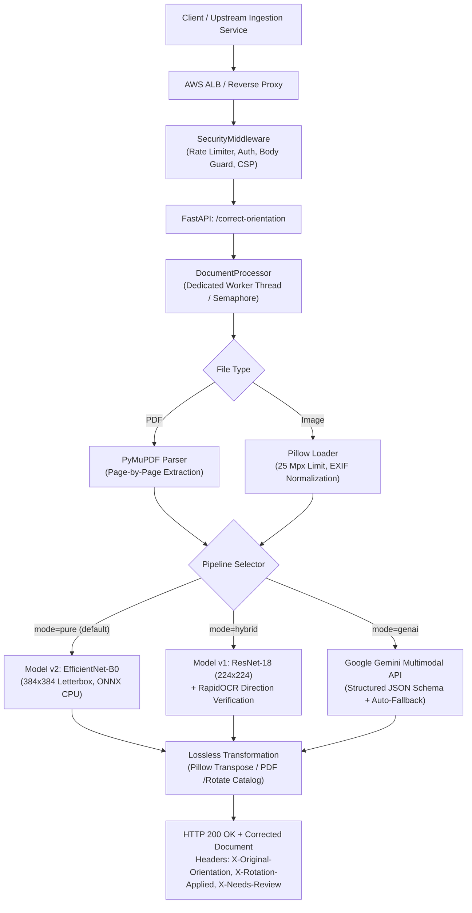

# Document Orientation Correction Service

[](https://www.python.org/downloads/)
[](https://fastapi.tiangolo.com)
[](https://onnxruntime.ai/)
[](https://ai.google.dev/)
[](docs/AWS_DEPLOYMENT_RUNBOOK.md)
[](tests/)

A hardened, high-throughput microservice for automatic document orientation detection and correction ($0^\circ, 90^\circ, 180^\circ, 270^\circ$). Built for enterprise document ingestion pipelines, scanned paperwork, mobile camera uploads, and multi-page contract processing.

---

## Key Capabilities

- **Lossless Multi-Page PDF Rotation**: Adjusts internal PDF page display matrices (`/Rotate`) in place without rasterizing or altering vector text, fonts, bookmarks, or document structure.
- **Three Independent Inference Pipelines**:
  1. **Pure CV (Production Default)**: EfficientNet-B0 ($384 \times 384$ letterboxed) via ONNX Runtime CPU. **Sub-35ms latency**, zero external dependencies.
  2. **Hybrid Pipeline (Text Verification)**: ResNet-18 ($224 \times 224$) paired with RapidOCR text-line direction verification for ambiguous $0^\circ$ vs $180^\circ$ upside-down decisions.
  3. **GenAI Multimodal (Zero-shot)**: Cloud-native visual reasoning powered by Google Gemini (`gemini-3.5-flash-lite` with automated fallback to `gemini-3.5-flash`).
- **Production Hardening & Reliability**:
  - **Pre-Parsing Body Limits**: $10\text{ MB}$ upload guard rejects oversized payloads before multipart ingestion to prevent memory exhaustion.
  - **Decompression Bomb Protection**: Input images exceeding $25,000,000$ pixels are rejected during decode.
  - **Thread-Safe Process Isolation**: Single-worker architecture (`DocumentProcessor`) protects native C++ libraries (PyMuPDF, RapidOCR, ONNX Runtime) from concurrency race conditions.
  - **Security Headers & Privacy**: Content Security Policy (`CSP`), `X-Content-Type-Options: nosniff`, `Cache-Control: no-store`, request tracing (`X-Request-Id`), and zero PII logging.
  - **Health Probes**: Dedicated `/live` (ALB liveness) and `/ready` (model warmup) endpoints.
  - **Abstention Policy**: Blank and low-confidence pages are left unmodified with an explicit `X-Needs-Review: true` header.

---

## Architecture



---

## Pipeline Comparison & Benchmark

Evaluated on the held-out DocLayNet v1.2 and CORD test benchmark (4,093 unique multi-domain document pages):

| Metric | Pure CV (v2) | Hybrid (v1 + OCR) | GenAI (Gemini 3.5) |
| :--- | :--- | :--- | :--- |
| **Model Backbone** | EfficientNet-B0 | ResNet-18 + RapidOCR | Gemini 3.5 Flash Lite |
| **Input Resolution** | $384 \times 384$ (letterboxed) | $224 \times 224$ (letterboxed) | Dynamic (max 1600px Lanczos) |
| **Test Accuracy** | **97.68%** | 97.77% | **99.1%** |
| **0° vs 180° Confusion** | < 1.1% | **< 0.8%** (OCR override) | < 0.5% |
| **Mean Latency (CPU)** | **28 ms / page** | ~185 ms / page (when OCR invoked) | ~780 ms / page (remote API) |
| **Throughput (1 vCPU)** | **~35 pages / sec** | ~5.4 pages / sec | Bound by API rate limits |
| **Dependencies** | ONNX Runtime only | ONNX Runtime + RapidOCR | HTTP client (`httpx`) |
| **Operational Cost** | **$0.00** | **$0.00** | ~$0.0001 / page |
| **Recommended Use** | High-volume production | Text-heavy edge cases | Zero-weights deployment / complex layouts |

---

## Quick Start (Local Run)

### 1. Environment Setup

```powershell
# Clone repository
git clone https://github.com/Kiril2206/doc-orientation-api.git
cd doc-orientation-api

# Create and activate virtual environment
python -m venv .venv
.\.venv\Scripts\Activate.ps1

# Install runtime dependencies
pip install -r requirements.txt
```

### 2. Configure Environment

Copy `.env.example` to `.env` (or configure via environment variables):

```dotenv
APP_INFERENCE_MODE=pure
APP_GEMINI_API_KEY=your_gemini_api_key_here
APP_GEMINI_MODEL=gemini-3.5-flash-lite
APP_REQUIRE_AUTH=false
```

### 3. Launch Application

```powershell
# Launch via automated PowerShell script
.\start-app.ps1

# Or run directly via uvicorn
.\.venv\Scripts\python.exe -m uvicorn app.main:app --host 127.0.0.1 --port 8000
```

Open **`http://127.0.0.1:8000/`** to interact with the web interface.

---

## API Reference

### Health & Monitoring Endpoints

- **`GET /live`**: ALB target group liveness probe. Returns `{"status":"alive"}` (HTTP 200). Bypasses authentication and model checks.
- **`GET /ready`**: Readiness probe. Verifies that the active inference models are loaded and warmed up with finite logits.
- **`GET /health`**: Diagnostic metadata detailing active models, memory limits, and timeouts.

### Document Correction Endpoint

**`POST /correct-orientation`**

#### Form Parameters
| Parameter | Type | Required | Description |
| :--- | :--- | :--- | :--- |
| `file` | Binary | Yes | Upload image (`.png`, `.jpg`, `.jpeg`, `.webp`, `.bmp`, `.tiff`) or `.pdf`. |
| `mode` | String | No | `pure` (default), `hybrid`, or `genai`. |
| `genai_prompt`| String | No | Optional contextual prompt for Gemini (max 2,000 chars). |

#### Response Headers
- `X-Original-Orientation`: Detected orientation angle (`0`, `90`, `180`, `270`).
- `X-Rotation-Applied`: Clockwise correction applied (`0`, `270`, `180`, `90`).
- `X-Inference-Mode`: Active pipeline (`pure`, `hybrid`, `genai`).
- `X-Model-Version`: Model identifier (`v2`, `v1`, `gemini-3.5-flash-lite`).
- `X-Needs-Review`: `true` if document was blank or confidence was below review threshold.
- `X-Page-Results`: JSON breakdown of decisions for every page in a PDF.
- `X-Request-Id`: Unique UUID for request tracing.

#### cURL Examples

```bash
# Correct a 90° rotated invoice using Pure CV (sub-35ms)
curl -X POST "http://localhost:8000/correct-orientation" \
  -F "file=@invoice.png" \
  -F "mode=pure" \
  --output corrected_invoice.png

# Correct a multi-page PDF using GenAI
curl -X POST "http://localhost:8000/correct-orientation" \
  -F "file=@contract.pdf" \
  -F "mode=genai" \
  --output corrected_contract.pdf
```

---

## AWS Deployment

Full step-by-step instructions are available in [**`docs/AWS_DEPLOYMENT_RUNBOOK.md`**](docs/AWS_DEPLOYMENT_RUNBOOK.md).

### Deployment Options

1. **Option 1: AWS EC2 Free Tier (100% Free - $0.00/mo)**:
   - Launch an Amazon Linux 2023 `t2.micro` or `t3.micro` instance.
   - Paste [`aws/ec2-userdata.sh`](aws/ec2-userdata.sh) into **User Data**.
   - Fully automated provisioning: installs dependencies, configures 2 GB swap, clones the repository, and registers the systemd service on port 80.
2. **Option 2: AWS App Runner (Serverless Container)**:
   - Connect ECR image to App Runner with 2 vCPU / 4 GB RAM.
   - Set health check path to `/live`.
3. **Option 3: AWS ECS Fargate + ALB (CloudFormation)**:
   - Enterprise deployment with isolated VPC subnets and Application Load Balancer using [`aws/cloudformation-template.yml`](aws/cloudformation-template.yml).

### Local Docker Testing

```bash
# Build and run container locally
docker compose up --build
```

---

## Test Suite & Verification

The test suite contains **140 automated tests** covering unit behavior, integration pipelines, stream safety, and AWS safeguards:

```powershell
# Run complete test suite
.\.venv\Scripts\python.exe -m pytest -v

# Run smoke test on active deployment
python scripts/smoke_test.py
```

---

## Documentation Index

- [**AWS Deployment Runbook**](docs/AWS_DEPLOYMENT_RUNBOOK.md): EC2 Free Tier setup, App Runner, ECS Fargate, CloudFormation, and cost models.
- [**Model v2 Architecture**](docs/MODEL_V2.md): EfficientNet-B0 vs ResNet-18, letterbox preprocessing, and ONNX benchmarks.
- [**GenAI Gemini Guide**](docs/GENAI.md): Multimodal visual prompting, schema enforcement, and fallback behavior.
- [**Dataset Manifest & Provenance**](docs/DATASETS.md): DocLayNet v1.2, CORD v2, and multilingual synthetic dataset curation.
- [**AWS Readiness Review**](docs/AWS_READINESS_REVIEW_2026_09_22.md): Senior technical review and mitigation audit.

---

## License

This project is licensed under the Apache 2.0 License. Training corpora (DocLayNet, CORD) are governed by their respective permissive licenses (CDLA-Permissive-1.0 and CC BY 4.0).
