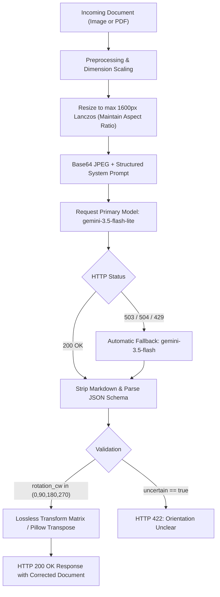

# GenAI Multimodal Route: Document Orientation via Google Gemini

The `genai` mode uses Google Gemini's multimodal vision capabilities to detect document orientation zero-shot. It requires no local ONNX model weights or GPU resources, making it ideal as a fallback or cloud-native orientation engine.

---

## 1. Quickstart & Configuration

### Requirements
The Gemini route uses standard Python HTTP client dependencies (`httpx`, `Pillow`, `pymupdf`), which are installed with the base `requirements.txt`:

```bash
pip install -r requirements.txt
```

### Environment Configuration (`.env`)

Generate an API key in [Google AI Studio](https://aistudio.google.com/apikey) and configure your environment:

```dotenv
APP_GEMINI_API_KEY=your_actual_api_key_here
APP_GEMINI_MODEL=gemini-3.5-flash-lite
APP_GEMINI_TIMEOUT_SECONDS=30
APP_GENAI_IMAGE_MAX_SIDE=1600
APP_GENAI_MAX_PDF_PAGES=10
```

> [!NOTE]
> The API key is stored strictly on the server and loaded into memory. It is never exposed in client headers, browser responses, or application logs.

---

## 2. API Usage

### Single Image Correction
```bash
curl -X POST "http://localhost:8000/correct-orientation" \
  -F "file=@document.png" \
  -F "mode=genai" \
  --output corrected.png
```

### Multi-Page PDF with Contextual Prompt
```bash
curl -X POST "http://localhost:8000/correct-orientation" \
  -F "file=@financial_report.pdf" \
  -F "mode=genai" \
  -F "genai_prompt=Use the tabular financial data to establish vertical reading order" \
  --output corrected_report.pdf
```

---

## 3. Architecture & Processing Flow



### Pipeline Steps:
1. **Resolution Normalization**: Images are converted to RGB and resized with aspect-ratio preservation to a maximum dimension of 1600 pixels (Lanczos filter) to ensure optimal visual comprehension while bounding payload size.
2. **Per-Page PDF Rendering**: Multi-page PDFs are rendered page-by-page at 150 DPI, respecting any existing `/Rotate` metadata. Each page is analyzed independently.
3. **Structured System Prompt**:
   - The model is instructed to determine the clockwise corrective rotation ($0^\circ, 90^\circ, 180^\circ, 270^\circ$).
   - Header position is treated as a supporting cue rather than an absolute rule.
   - Text inside the image is explicitly demarcated as document content, preventing prompt injection attacks.
4. **Structured JSON Schema**:
   ```json
   {
     "rotation_cw": 90,
     "uncertain": false
   }
   ```
5. **Lossless Application**:
   - For images: Clockwise transposition using Pillow (`Image.Transpose`).
   - For PDFs: In-place adjustment of `/Rotate` page attributes in the PDF catalog. Text streams, vector shapes, fonts, and hyperlinks are 100% preserved.

---

## 4. Production Hardening & High-Availability

### Dynamic Model Fallback
During peak periods, specific Gemini model endpoints may experience temporary demand surges (`HTTP 503 Service Unavailable`). The `GeminiOrientationClassifier` automatically retries requests against `gemini-3.5-flash` if `gemini-3.5-flash-lite` returns an error or times out.

### Markdown Code Block Unwrapping
Certain model variants wrap structured JSON outputs in markdown code fences (` ```json ... ``` `). The response parser strips leading and trailing code blocks before JSON parsing to prevent formatting failures.

### Error Sanitization & Security
- **Strict Data Redaction**: Raw Gemini response bodies, network traces, and API keys are never included in HTTP error messages returned to clients.
- **Client Status Codes**:
  - `400`: Bad file input or unsupported format.
  - `413`: File or page count exceeds limits (`APP_GENAI_MAX_PDF_PAGES=10`).
  - `422`: Document is ambiguous or orientation cannot be determined (`uncertain=true`).
  - `502`: Model returned malformed or incomplete output.
  - `503`: API key missing or provider quota exceeded.
  - `504`: Request timed out (`APP_GEMINI_TIMEOUT_SECONDS=30`).

---

## 5. Verification & Testing

Mocked end-to-end integration tests verify error sanitization, angle mappings, PDF page limits, and response parsing without consuming live API quota:

```powershell
python -m pytest tests/test_genai.py -v
```

All 20 test cases pass, verifying:
- Correct clockwise angle rotation transformations ($0^\circ \to 0^\circ$, $90^\circ \to 270^\circ$, $180^\circ \to 180^\circ$, $270^\circ \to 90^\circ$).
- Strict rejection of missing, out-of-range, or non-integer angles.
- Page limit enforcement prior to network requests.
- Secure redaction of internal errors.
